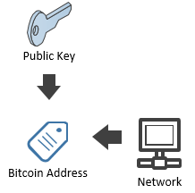
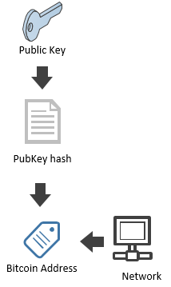

## Bitcoin Address {#bitcoin-address}

You know that your **Bitcoin Address** is what you share to the world to get paid.  
  
You probably know that your wallet software uses a **private key** to spend the money you received on this address.  
  

The keys are not stored in the network and they can be generated without access to the Internet.  

With code:  
```cs  
Key privateKey = new Key(); // generate a random private key
```  
From the private key, we use elliptic curve multiplication, a one-way cryptographic function, to generate a **public key**.  

  
```cs 
PubKey publicKey = privateKey.PubKey;
Console.WriteLine(publicKey); // 0251036303164f6c458e9f7abecb4e55e5ce9ec2b2f1d06d633c9653a07976560c
```  

> **Fact:** TestNet is a Bitcoin network for development purposes. Bitcoins on this network worth nothing.  MainNet is the bitcoin network everybody knows.  

You can magically get your **bitcoin address** from your public key and by specifying the **network**. *(You should enjoy this magic now, because I will clear it up shortly.)*  

  

```cs 
Console.WriteLine(publicKey.GetAddress(Network.Main)); // 1PUYsjwfNmX64wS368ZR5FMouTtUmvtmTY
Console.WriteLine(publicKey.GetAddress(Network.TestNet)); // n3zWAo2eBnxLr3ueohXnuAa8mTVBhxmPhq
```  

**More accurately a bitcoin address is made up of a Base58check encoded combination of your public key’s hash and some information about the network the address is for:**  

  

```cs 
var publicKeyHash = publicKey.Hash;
Console.WriteLine(publicKeyHash); // f6889b21b5540353a29ed18c45ea0031280c42cf
var mainNetAddress = publicKeyHash.GetAddress(Network.Main);
var testNetAddress = publicKeyHash.GetAddress(Network.TestNet);
```  

> **Fact:** The hash of the public key is generated by performing a SHA256 hash on the public key, and then performing a RIPEMD160 hash on the result, with Big Endian notation. The function could look like this: RIPEMD160(SHA256(pubkey))  

The Base58Check encoding has some neat features, such as checksums to prevent typos and a lack of ambiguous characters such as '0' and 'O'.  

```cs 
Console.WriteLine(mainNetAddress); // 1PUYsjwfNmX64wS368ZR5FMouTtUmvtmTY
Console.WriteLine(testNetAddress); // n3zWAo2eBnxLr3ueohXnuAa8mTVBhxmPhq
```  

> **Fact:** Practicing Bitcoin Programming on MainNet makes mistakes more memorable.  