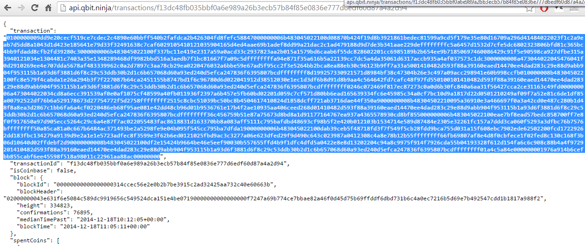
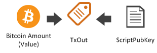
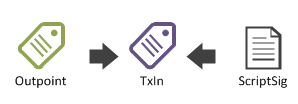

## Transaction {#transaction}

> ([Mastering Bitcoin](https://github.com/bitcoinbook/bitcoinbook/)) Transactions are the most important part of the bitcoin system. Everything else in bitcoin is designed to ensure that transactions can be created, propagated on the network, validated, and finally added to the global ledger of transactions (the blockchain). Transactions are data structures that encode the transfer of value between participants in the bitcoin system. Each transaction is a public entry in bitcoin’s blockchain, the global double-entry bookkeeping ledger.

A transaction may have no recipient, or it may have several. **The same can be said for senders!** On the Blockchain, the sender and recipient are always abstracted with a ScriptPubKey, as we demonstrated in previous chapters.  

If you use Bitcoin Core your Transactions tab will show the transaction, like this:

  

For now we are interested in the **Transaction ID**. In this case, it is ```f13dc48fb035bbf0a6e989a26b3ecb57b84f85e0836e777d6edf60d87a4a2d94```  

> **Note:** The TransactionId is defined by SHA256(SHA256(txbytes))

> **Note:** Do NOT use the TransactionId to handle unconfirmed transactions. The TransactionId can be manipulated before it is confirmed. This is known as “Transaction Malleability.”

You can review the transaction on a blockexplorer like Blockchain.info: https://blockchain.info/tx/f13dc48fb035bbf0a6e989a26b3ecb57b84f85e0836e777d6edf60d87a4a2d94 
But as a developer you will probably want a service that is easier to query and parse.  
As a C# developer and an NBitcoin user Nicolas Dorier's [QBit Ninja](http://docs.qbitninja.apiary.io/) will definitely be your best choice. It is an open source web service API to query the blockchain and for tracking wallets.  
QBit Ninja depends on [NBitcoin.Indexer](https://github.com/MetacoSA/NBitcoin.Indexer) which rely on Microsoft Azure Storage. C# developers are expected to use the [NuGet client package](http://www.nuget.org/packages/QBitninja.Client) instead of developping a wrapper around this API.  

If you go to http://api.qbit.ninja/transactions/f13dc48fb035bbf0a6e989a26b3ecb57b84f85e0836e777d6edf60d87a4a2d94 you will see the raw bytes of your transaction.  

  

You can parse the transaction from hex with the following code:  

```cs
Transaction tx = new Transaction("0100000...");
```

Quickly close the tab, before it scares you away, QBit Ninja queries the API and parses the information so go ahead and install **QBitNinja.Client** NuGet package.  

  

Query the transaction by id:

```cs
// Create a client
QBitNinjaClient client = new QBitNinjaClient(Network.Main);
// Parse transaction id to NBitcoin.uint256 so the client can eat it
var transactionId = uint256.Parse("f13dc48fb035bbf0a6e989a26b3ecb57b84f85e0836e777d6edf60d87a4a2d94");
// Query the transaction
GetTransactionResponse transactionResponse = client.GetTransaction(transactionId).Result;
```  

The type of **transactionResponse** is **GetTransactionResponse**. It lives under QBitNinja.Client.Models namespace. You can get **NBitcoin.Transaction** type from it:  

```cs
NBitcoin.Transaction transaction = transactionResponse.Transaction;
```  
 
Let's see an example getting back the transaction id with both classes:  

```cs
Console.WriteLine(transactionResponse.TransactionId); // f13dc48fb035bbf0a6e989a26b3ecb57b84f85e0836e777d6edf60d87a4a2d94
Console.WriteLine(transaction.GetHash()); // f13dc48fb035bbf0a6e989a26b3ecb57b84f85e0836e777d6edf60d87a4a2d94
```  

**GetTransactionResponse** has additional information about the transaction like the value and scriptPubKey of the inputs being spent in the transaction.

The relevant parts for now are the **inputs** and **outputs**. You can see that out 13.19683492 Bitcoin has been sent to a ScriptPubKey:

```cs
List<ICoin> receivedCoins = transactionResponse.ReceivedCoins;
foreach (var coin in receivedCoins)
{
    Money amount = coin.Amount;

    Console.WriteLine(amount.ToDecimal(MoneyUnit.BTC));
    var paymentScript = coin.ScriptPubKey;
    Console.WriteLine(paymentScript);  // It's the ScriptPubKey
    var address = paymentScript.GetDestinationAddress(Network.Main);
    Console.WriteLine(address);
    Console.WriteLine();
}
```  

We have written out some information about the RECEIVED COINS using QBitNinja's GetTransactionResponse class.
**Exercise**: Write out the same information about the SPENT COINS using QBitNinja's GetTransactionResponse class!  

Let's see how we can get the same information about the RECEIVED COINS using NBitcoin's Transaction class.

```cs
var outputs = transaction.Outputs;
foreach (TxOut output in outputs)
{
    Money amount = output.Value;

    Console.WriteLine(amount.ToDecimal(MoneyUnit.BTC));
    var paymentScript = output.ScriptPubKey;
    Console.WriteLine(paymentScript);  // It's the ScriptPubKey
    var address = paymentScript.GetDestinationAddress(Network.Main);
    Console.WriteLine(address);
    Console.WriteLine();
}
```  

Now let's examine the **inputs**. If you look at them you will notice a previous output is referenced. Each input shows you which previous out has been spent in order to fund this transaction.

```cs
var inputs = transaction.Inputs;
foreach (TxIn input in inputs)
{
    OutPoint previousOutpoint = input.PrevOut;
    Console.WriteLine(previousOutpoint.Hash); // hash of prev tx
    Console.WriteLine(previousOutpoint.N); // idx of out from prev tx, that has been spent in the current tx
    Console.WriteLine();
}
```  

The terms **TxOut**, **Output** and **out** are synonymous.  
Not to be confused with **OutPoint**, but more on this later.

In summary, the TxOut represents an amount of bitcoin and a **ScriptPubKey**. (Recipient)  

  
As illustration let's create a txout with 21 bitcoin from the first ScriptPubKey in our current transaction:  

```cs  
Money twentyOneBtc = new Money(21, MoneyUnit.BTC);
var scriptPubKey = transaction.Outputs.First().ScriptPubKey;
TxOut txOut = new TxOut(twentyOneBtc, scriptPubKey);
```  

Every **TxOut** is uniquely addressed at the blockchain level by the ID of the transaction which include it and its index inside it. We call such reference an **Outpoint**.  


For example, the **Outpoint** of the **TxOut** with 13.19683492 BTC in our transaction is (4788c5ef8ffd0463422bcafdfab240f5bf0be690482ceccde79c51cfce209edd, 0).  

```cs
OutPoint firstOutPoint = spentCoins.First().Outpoint;
Console.WriteLine(firstOutPoint.Hash); // 4788c5ef8ffd0463422bcafdfab240f5bf0be690482ceccde79c51cfce209edd
Console.WriteLine(firstOutPoint.N); // 0
```  

Now let’s take a closer look at the inputs (aka **TxIn**) of the transaction:  



The **TxIn** is composed of the **Outpoint** of the **TxOut** being spent and of the **ScriptSig** ( we can see the ScriptSig as the “Proof of Ownership”) In our transaction there are actually 9 inputs.  

```cs
Console.WriteLine(transaction.Inputs.Count); // 9
```  

With the previous outpoint's transaction ID we can review the information associated with that transaction.  
```cs
OutPoint firstPreviousOutPoint = transaction.Inputs.First().PrevOut;
var firstPreviousTransaction = client.GetTransaction(firstPreviousOutPoint.Hash).Result.Transaction;
Console.WriteLine(firstPreviousTransaction.IsCoinbase); // False
```  

We could continue to trace the transaction IDs back in this manner until we reach a **coinbase transaction**, the transaction including the newly mined coin by a miner.  
**Exercise:** Follow the first input of this transaction and its ancestors until you find a coinbase transaction!  
Hint: After a few minutes and 30-40 transaction, I gave up tracing back.  
Yes, you've guessed right, it is not the most efficient way to do this, but a good exercise.  

In our example, the outputs were for a total of 13.19**70**3492 BTC.  

```cs
Money spentAmount = Money.Zero;
foreach (var spentCoin in spentCoins)
{
    spentAmount = (Money)spentCoin.Amount.Add(spentAmount);
}
Console.WriteLine(spentAmount.ToDecimal(MoneyUnit.BTC)); // 13.19703492
```  

In this transaction 13.19**68**3492 BTC were received.  

**Exercise:** Get the total received amount, as I have been done with the spent amount.  

That means 0.0002 BTC (or 13.19**70**3492 - 13.19**68**3492) is not accounted for! The difference between the inputs and outputs are called **Transaction Fees** or **Miner’s Fees**. This is the money that the miner collects for including a given transaction in a block.  

```cs
var fee = transaction.GetFee(spentCoins.ToArray());
Console.WriteLine(fee);
```

You should note that a **coinbase transaction** is the only transaction whose value of output are superior to the value of input. This effectively correspond to coin creation. So by definition there is no fee in a coinbase transaction. The coinbase transaction is the first transaction of every block.
The consensus rule enforce that the sum of output's value in the coinbase transaction does not exceed the sum of transaction fees in the block plus the mining reward.