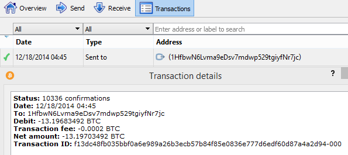

## Transaction {#transaction}

> ([Mastering Bitcoin](https://github.com/bitcoinbook/bitcoinbook/)) Transactions are the most important part of the bitcoin system. Everything else in bitcoin is designed to ensure that transactions can be created, propagated on the network, validated, and finally added to the global ledger of transactions (the blockchain). Transactions are data structures that encode the transfer of value between participants in the bitcoin system. Each transaction is a public entry in bitcoin’s blockchain, the global double-entry bookkeeping ledger.

A transaction may have no recipient, or it may have several. **The same can be said for senders!** On the Blockchain, the sender and recipient are always abstracted with a ScriptPubKey, as we demonstrated in previous chapters.  

If you use Bitcoin Core your Transactions tab will show the transaction, like this:

  

For now we are interested in the **Transaction ID**. In this case, it is ```f13dc48fb035bbf0a6e989a26b3ecb57b84f85e0836e777d6edf60d87a4a2d94```  

> **Note:** The TransactionId is defined by SHA256(SHA256(txbytes))

> **Note:** Do NOT use the TransactionId to handle unconfirmed transactions. The TransactionId can be manipulated before it is confirmed. This is known as “Transaction Malleability.”

You can review the transaction on a blockexplorer like Blockchain.info: https://blockchain.info/tx/f13dc48fb035bbf0a6e989a26b3ecb57b84f85e0836e777d6edf60d87a4a2d94 
But as a developer you will probably want a service that is easier to query and parse.  
As a C# developer and an NBitcoin user Nicolas Dorier's [QBit Ninja](http://docs.qbitninja.apiary.io/) will definitely be your best choice. It is an open source web service API to query the blockchain and for tracking wallets.  
QBit Ninja depends on [NBitcoin.Indexer](https://github.com/MetacoSA/NBitcoin.Indexer) which rely on Microsoft Azure Storage. C# developers are expected to use the [NuGet client package](http://www.nuget.org/packages/QBitninja.Client) instead of developping a wrapper around this API.  

If you go to http://api.qbit.ninja/transactions/f13dc48fb035bbf0a6e989a26b3ecb57b84f85e0836e777d6edf60d87a4a2d94 you will see the raw bytes of your transaction.  

  

Quickly close the tab, before it scares you away from the computer. QBit Ninja queries the API and parses the information for you so you don’t have to do it manually.  
Go ahaead and install **QBitNinja.Client** NuGet package.  

  

Query the transaction by id:

```cs
// Create a client
QBitNinjaClient client = new QBitNinjaClient(Network.Main);
// Parse transaction id to NBitcoin.uint256 so the client can eat it
var transactionId = uint256.Parse("f13dc48fb035bbf0a6e989a26b3ecb57b84f85e0836e777d6edf60d87a4a2d94");
// Query the transaction
GetTransactionResponse transactionResponse = client.GetTransaction(transactionId).Result;
```  

The type of **transactionResponse** is **GetTransactionResponse**. It lives under QBitNinja.Client.Models namespace. You can get **NBitcoin.Transaction** type from it:  

```cs
NBitcoin.Transaction transaction = transactionResponse.Transaction;
```  

Basically **QBitNinja's GetTransactionResponse** class is higher level abstraction of a transaction, most of the time it will be enough to use that.
An example getting back the transaction id from both classes:  

```cs
Console.WriteLine(transactionResponse.TransactionId); // f13dc48fb035bbf0a6e989a26b3ecb57b84f85e0836e777d6edf60d87a4a2d94
Console.WriteLine(transaction.GetHash()); // f13dc48fb035bbf0a6e989a26b3ecb57b84f85e0836e777d6edf60d87a4a2d94
```  


The relevant parts for now are **in** and **out**. You can see that in out 0.0899 Bitcoin has been sent to a scriptPubKey, and 0.01 has been sent to another. (**Exercise**: Verify the public key hash in this ScriptPubKey is the same as the one associated with your paymentAddress)

If you look at the **in** you will notice a **prev_out** (previous **out**) is referenced. Each in show you which previous out has been spent in order to fund this transaction. The terms **TxOut** and **Output** are synonymous with out.

In summary, the TxOut represents an amount of bitcoin and a **ScriptPubKey**. (Recipient)

Every outhas an address defined by the transaction ID andindex called the **Outpoint**. For example, the Outpoint of the out with 0.01 BTC in my transaction is (71049fd47ba2107db70d53b127cae4ff0a37b4ab, 1).

Now let’s take a look at the in (aka **TxIn**, **Inputs**) of the transaction:

The TxIn is composed of the Outpoint of the prev_out being spent and of a **ScriptSig** also called “Proof of Ownership.” In my case, the prev_out Outpoint is (7def8a69a7a2c14948f3c4b9033b7b30f230308b, 0)

By replacing the transaction ID in the code we wrote for Lesson1 we can review the information associated with that transaction. We could continue to trace the transaction IDs back in this manner until we reach the bitcoins’ **coinbase,** the block where they were mined.

In our example, the prev_out was for a total of .1 BTC. In this transaction .0899 BTC and .01 BTC were sent. That means 0.0001 BTC (or 0.1 - (0.0899+0.01)) is not accounted for! The difference between the inputs and outputs are called **Transaction Fees** or **Miner’s Fees**. This is the money that the miner collects for including a given transaction in a block.