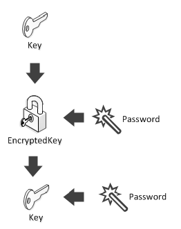

## Key Encryption {#key-encryption}

In the previous part I talked quickly about a special KDF called **Scrypt.** As I said, the goal of a KDF is to make brute force costly.  

So it should be no surprise for you that a standard already exists for encrypting your private key with a password using a KDF. This is [BIP38](http://www.codeproject.com/Articles/775226/NBitcoin-Cryptography-Part).  

  

```cs
var privateKey = new Key();
var bitcoinPrivateKey = privateKey.GetWif(Network.Main);
Console.WriteLine(bitcoinPrivateKey); // L1tZPQt7HHj5V49YtYAMSbAmwN9zRjajgXQt9gGtXhNZbcwbZk2r
BitcoinEncryptedSecret encryptedBitcoinPrivateKey = bitcoinPrivateKey.Encrypt("password");
Console.WriteLine(encryptedBitcoinPrivateKey); // 6PYKYQQgx947Be41aHGypBhK6TA5Xhi9TdPBkatV3fHbbKrdDoBoXFCyLK
var decryptedBitcoinPrivateKey = encryptedBitcoinPrivateKey.GetSecret("password");
Console.WriteLine(decryptedBitcoinPrivateKey); // L1tZPQt7HHj5V49YtYAMSbAmwN9zRjajgXQt9gGtXhNZbcwbZk2r

Console.ReadLine();
```  

Such encryption is used in two different cases:  

*   You don not trust your storage provider (they can get hacked)  
*   You are storing the key on the behalf of somebody else (and you do not want to know his key)  

If you own your storage, then encrypting at the database level might be enough.  

Be careful if your server takes care of decrypting the key, an attacker might attempt to DDOS your server by forcing it to decrypt lots of keys.  

Delegate decryption to the ultimate user when you can.  