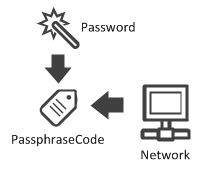
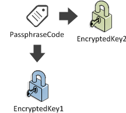
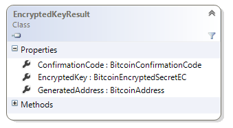

## Key Generation {#key-generation}

### Like the good ol’ days {#like-the-good-ol-days}

First, why generating several keys?  
The main reason is privacy. Since you can see the balance of all addresses, it is better to use a new address for each transaction.  

However, in practice, you can also generate keys for each contact. Because this make a simple way to identify your payer without leaking too much privacy.  

You can generate key, like you did from the beginning:

```cs
var privateKey = new Key()
```  

However, you have two problems with that:  

*   All backup of your wallet that you have will become outdated when you generate a new key.  
*   You cannot delegate the address creation process to an untrusted peer.  

If you are developing a web wallet and generate key on behalf of your users, and one user get hacked, she will immediately start suspecting you.  

### BIP38 (Part 2) {#bip38-part-2}

We already saw BIP38 for encrypting a key, however this BIP is in reality two ideas in one document.  

The second part of the BIP, show how you can delegate Key and Address creation to an untrusted peer. It will fix one of our concern.  

**The idea is to generate a PassphraseCode to the key generator. With this PassphraseCode, he will be able to generate encrypted keys on your behalf, without knowing your password, nor any private key. ** 

This **PassphraseCode** can be given to your key generator in WIF format.  

> **Tip**: In NBitcoin, all types prefixed by “Bitcoin” are Base58 (WIF) data.  

So, as a user that want to delegate key creation, first you will create the **PassphraseCode**.

  

```cs
var passphraseCode = new BitcoinPassphraseCode("my secret", Network.Main, null);
```

**You then give this passphraseCode to a third party key generator.**

The third party will then generate new encrypted keys for you.

  

```cs
EncryptedKeyResult encryptedKeyResult = passphraseCode.GenerateEncryptedSecret();
```  

This **EncryptedKeyResult** have lots of information:  

  

First: the **generated bitcoin address**,  
```cs
var generatedAddress = encryptedKeyResult.GeneratedAddress; // 14KZsAVLwafhttaykXxCZt95HqadPXuz73
```  
then the **EncryptedKey** itself, (as we have seen in the previous, **Key Encryption** lesson),  
```cs
var encryptedKey = encryptedKeyResult.EncryptedKey; // 6PnWtBokjVKMjuSQit1h1Ph6rLMSFz2n4u3bjPJH1JMcp1WHqVSfr5ebNS
```  
and last but not the least, the **ConfirmationCode**, so that the third party can prove that the generated key and address correspond effectively to your password.
```cs
var confirmationCode = encryptedKeyResult.ConfirmationCode; // cfrm38VUcrdt2zf1dCgf4e8gPNJJxnhJSdxYg6STRAEs7QuAuLJmT5W7uNqj88hzh9bBnU9GFkN
```  

As the owner, once you receive these info, you need to check that the key generator did not cheat by using **ConfirmationCode.Check**, then get your private key with your password:

```cs
Console.WriteLine(confirmationCode.Check("my secret", generatedAddress)); // True
var bitcoinPrivateKey = encryptedKey.GetSecret("my secret");
Console.WriteLine(bitcoinPrivateKey.GetAddress() == generatedAddress); // True
Console.WriteLine(bitcoinPrivateKey); // KzzHhrkr39a7upeqHzYNNeJuaf1SVDBpxdFDuMvFKbFhcBytDF1R
```  

So, we have just seen how the third party can generate encrypted key on your behalf, without knowing your password and private key.

  

However, one problem remains:

*   All backup of your wallet that you have will become outdated when you generate a new key.

BIP 32, or Hierarchical Deterministic Wallets (HD wallets) proposes another solution, and is more widely supported.

### HD Wallet (BIP 32) {#hd-wallet-bip-32}

Let’s keep in mind the problems that we want to resolve:

*   Prevent outdated backups
*   Delegating key / address generation to an untrusted peer

A “Deterministic” wallet would fix our backup problem. With such wallet, you would have to save only the seed. From this seed, you can generate the same series of private key over and over.  

This is what the “Deterministic” stands for.  
As you can see, from the master key, I can generate new keys:  

```cs
ExtKey masterKey = new ExtKey();
Console.WriteLine("Master key : " + masterKey.ToString(Network.Main));
for (int i = 0; i < 5; i++)
{
    ExtKey key = masterKey.Derive((uint)i);
    Console.WriteLine("Key " + i + " : " + key.ToString(Network.Main));
}
```  

```
Master key : xprv9s21ZrQH143K3JneCAiVkz46BsJ4jUdH8C16DccAgMVfy2yY5L8A4XqTvZqCiKXhNWFZXdLH6VbsCsqBFsSXahfnLajiB6ir46RxgdkNsFk
Key 0 : xprv9tvBA4Kt8UTuEW9Fiuy1PXPWWGch1cyzd1HSAz6oQ1gcirnBrDxLt8qsis6vpNwmSVtLZXWgHbqff9rVeAErb2swwzky82462r6bWZAW6Ty
Key 1 : xprv9tvBA4Kt8UTuHyzrhkRWh9xTavFtYoWhZTopNHGJSe3KomssRrQ9MTAhVWKFp4d7D8CgmT7TRzauoAZXp3xwHQfxr7FpXfJKpPDUtiLdmcF
Key 2 : xprv9tvBA4Kt8UTuLoEZPpW9fBEzC3gfTdj6QzMp8DzMbAeXgDHhSMmdnxSFHCQXycFu8FcqTJRm2kamjeE8CCKzbiXyoKWZ9ihiF7J5JicgaLU
Key 3 : xprv9tvBA4Kt8UTuPwJQyxuZoFj9hcEMCoz7DAWLkz9tRMwnBDiZghWePdD7etfi9RpWEWQjKCM8wHvKQwQ4uiGk8XhdKybzB8n2RVuruQ97Vna
Key 4 : xprv9tvBA4Kt8UTuQoh1dQeJTXsmmTFwCqi4RXWdjBp114rJjNtPBHjxAckQp3yeEFw7Gf4gpnbwQTgDpGtQgcN59E71D2V97RRDtxeJ4rVkw4E
Key 5 : xprv9tvBA4Kt8UTuTdiEhN8iVDr5rfAPSVsCKpDia4GtEsb87eHr8yRVveRhkeLEMvo3XWL3GjzZvncfWVKnKLWUMNqSgdxoNm7zDzzD63dxGsm
```  

You only need to save the masterKey, since you can generate the same suite of private keys over and over.

As you can see, these keys are **ExtKey** and not **Key** as you are used to. However, this should not stop you since you have the real private key inside:

The **base58** type equivalent of **ExtKey** is called **BitcoinExtKey**.

But how can we solve our second problem: delegating address creation to a peer that can potentially be hacked (like a payment server)?

The trick is that you can “neuter” your master key, then you have a public (without private key) version of the master key. From this neutered version, a third party can generate public keys without knowing the private key.

PubKey 0 : xpub67uQd5a6WCY6A7NZfi7yGoGLwXCTX5R7QQfMag8z1RMGoX1skbXAeB9JtkaTiDoeZPprGH1drvgYcviXKppXtEGSVwmmx4pAdisKv2CqoWS

PubKey 1 : xpub67uQd5a6WCY6CUeDMBvPX6QhGMoMMNKhEzt66hrH6sv7rxujt7igGf9AavEdLB73ZL6ZRJTRnhyc4BTiWeXQZFu7kyjwtDg9tjRcTZunfeR

PubKey 2 : xpub67uQd5a6WCY6Dxbqk9Jo9iopKZUqg8pU1bWXbnesppsR3Nem8y4CVFjKnzBUkSVLGK4defHzKZ3jjAqSzGAKoV2YH4agCAEzzqKzeUaWJMW

PubKey 3 : xpub67uQd5a6WCY6HQKya2Mwwb7bpSNB5XhWCR76kRaPxchE3Y1Y2MAiSjhRGftmeWyX8cJ3kL7LisJ3s4hHDWvhw3DWpEtkihPpofP3dAngh5M

PubKey 4 : xpub67uQd5a6WCY6JddPfiPKdrR49KYEuXUwwJJsL5rWGDDQkpPctdkrwMhXgQ2zWopsSV7buz61e5mGSYgDisqA3D5vyvMtKYP8S3EiBn5c1u4

So imagine that your payment server generate pubkey1, you can get the corresponding private key with your private master key.

Generated address : 1Jy8nALZNqpf4rFN9TWG2qXapZUBvquFfX

Expected address : 1Jy8nALZNqpf4rFN9TWG2qXapZUBvquFfX

**ExtPubKey** is similar to **ExtKey** except that it holds a **PubKey** and not a **Key**.

Now we have seen how Deterministic keys solve our problems, let’s speak about what the “hierarchical” is for.

In the previous exercise, we have seen that by combining master key + index we could generate another key. We call this process **Derivation**, master key is the **parent key**, and the generated key is called **child key**.

However, you can also derivate children from the child key. This is what the “hierarchical” stands for.

This is why conceptually more generally you can say: Parent Key + KeyPath => Child Key

In this diagram, you can derivate Child(1,1) from parent in two different way:

Or

So in summary:

It works the same for **ExtPubKey**.

Why do you need hierarchical keys? Because it might be a nice way to classify the type of your keys for multi account purpose. More on [BIP44](https://github.com/bitcoin/bips/blob/master/bip-0044.mediawiki).

It also permit to segment account rights across an organization.

Imagine you are CEO of a company. You want control over all wallet, but you don’t want that the Accounting department spend the money of the Marketing department.

So your first idea would be to generate one hierarchy for each department.

However, in such case, **Accounting** and **Marketing** would be able to recover the CEO’s private key.

We define such child keys as **non-hardened**.

CEO: xprv9s21ZrQH143K2XcJU89thgkBehaMqvcj4A6JFxwPs6ZzGYHYT8dTchd87TC4NHSwvDuexuFVFpYaAt3gztYtZyXmy2hCVyVyxumdxfDBpoC

CEO recovered: xprv9s21ZrQH143K2XcJU89thgkBehaMqvcj4A6JFxwPs6ZzGYHYT8dTchd87TC4NHSwvDuexuFVFpYaAt3gztYtZyXmy2hCVyVyxumdxfDBpoC

In other words, a **non-hardened key** can “climb” the hierarchy.**Non-hardened key** should only be used for categorizing accounts that belongs to a **single control**.

So in our case, the CEO should create a **hardened key**, so the accounting department will not be able to climb.

You can also create hardened key by via the **ExtKey.Derivate**(**KeyPath)**, by using an apostrophe after a child’s index:

So let’s imagine that the Accounting Department generate 1 parent key for each customer, and a child for each of the customer’s payment.

As the CEO, you want to spend the money on one of these addresses. Here is how you would proceed.

### Mnemonic Code for HD Keys (BIP39) {#mnemonic-code-for-hd-keys-bip39}

As you have seen, generating an HD keys is easy. However, what if we want as easy way to transmit such key by telephone or hand writing?

Cold wallets like Trezor, generates the HD Keys from a sentence that can easily be written down. They call such sentence “the seed” or “mnemonic”. And it can eventually be protected by a password or a PIN.

The language that you use to generate your easy to write sentence is called a **Wordlist**

minute put grant neglect anxiety case globe win famous correct turn link

Now, if you have the mnemonic and the password, you can recover the **hdRoot** key.

Currently supported **wordlist** are, English, Japanese, Spanish, Chinese (simplified an traditional).

### Dark Wallet {#dark-wallet}

This name is unfortunate since there is nothing dark about it, and it attract unwanted attention and worries.Dark Wallet is a practical solution that fix our two initial problems:

*   Prevent outdated backups
*   Delegating key / address generation to an untrusted peer

But it has a bonus killer feature.

You have to share only one address with the world (called **StealthAddress**), without leaking any privacy.

Let’s remind us that if you share one **BitcoinAddress** with everybody, then all can see your balance by consulting the blockchain… That’s not the case with a **StealthAddress**.

This is a real shame it was labeled as **dark** since it solves partially the important problem of privacy leaking caused by the pseudo-anonymity of Bitcoin. A better name would have been: **One Address**.

In Dark Wallet terminology, here are the different actors:

*   **Scanner** knows the **Scan Key**, a secret that allows him to detect the transactions that belong to the **Receiver**.
*   The **Receiver** knows the **Spend Key**, a secret that will allows him to spend the coins he receives from one of such transaction.
*   The **Payer** knows the **StealthAddress** of the **Receiver**

The rest is operational details.Underneath, this **StealthAddress** is composed of one or several **Spend PubKey** (for multi sig), and one **Scan PubKey**.

The **payer**, will take your **StealthAddress**, generate a temporary key called **Ephem Key** and will generate a **Stealth Pub Key**, from which the Bitcoin address to which the payment will be done is generated.

Then, he will package the **Ephem PubKey** in a **Stealth Metadata** object embedded that in the OP_RETURN of the transaction (as we have done for the first challenge)

He will also add the output to the generated bitcoin address. (the address of the **Stealth pub key**)

The creation of the **EphemKey** being an implementation details, you can omit it, NBitcoin will generate one automatically:

{

….

"in": [],

"out": [

{

"value": "0.00000000",

"scriptPubKey": "OP_RETURN 06000000000211e76c3de929f7d8b3473f6e41fc31016d7a3e56a47e9f541b0d1cc7fa3f8819"

},

{

"value": "1.00000000",

"scriptPubKey": "OP_DUP OP_HASH160 b4638a6b452bbfc6fdbb4e1e8c9f1952bbd18c39 OP_EQUALVERIFY OP_CHECKSIG"

}

]

}

Then the payer add and signs the inputs, then sends the transaction on the network.

The **Scanner** knowing the **StealthAddress** and the **Scan Key** can recover the **Stealth PubKey** and so expected **BitcoinAddress** payment.

Then the scanner checks if one of the output of the transaction correspond to such address. If it is, then **Scanner** notify the **Receiver** about the transaction.

The **Receiver** can then get the private key of the address with his **Spend Key**.

The code explaining how, as a Scanner, to scan a transaction and how, as a Receiver, to uncover the private key, will be explained later in the **TransactionBuilder** part.

It should be noted that a **StealthAddress** can have multiple **spend pubkeys**, in which case, the address represent a multi sig.

One limit of Dark Wallet is the use of **OP_RETURN**, so we can’t easily embed arbitrary data in the transaction as we have done for in Bitcoin Transfer. (Current bitcoin rules allows only one OP_RETURN of 40 bytes, soon 80, per transaction)