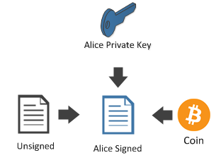

## Multi Sig {#multi-sig}

Bitcoin allows us to have shared ownership and control over coins with multi-signature transactions or multisig for short. 

In order to demonstrate this we will create a ```ScriptPubKey``` that represents an **m-of-n multisig**. This means that in order to spend the coins, **m** number of private keys will be needed to sign the spending transaction out of the **n** number of different public keys provided.

Let’s create a multi sig with Bob, Alice and Satoshi, where two of the three of them need to sign a transaction in order to spend a coin.  

```cs
Key bob = new Key();
Key alice = new Key();
Key satoshi = new Key();

var scriptPubKey = PayToMultiSigTemplate
    .Instance
    .GenerateScriptPubKey(2, new[] { bob.PubKey, alice.PubKey, satoshi.PubKey });

Console.WriteLine(scriptPubKey);
```  
Generates this script which you can use as a public key (coin destination address):
```
2 0282213c7172e9dff8a852b436a957c1f55aa1a947f2571585870bfb12c0c15d61 036e9f73ca6929dec6926d8e319506cc4370914cd13d300e83fd9c3dfca3970efb 0324b9185ec3db2f209b620657ce0e9a792472d89911e0ac3fc1e5b5fc2ca7683d 3 OP_CHECKMULTISIG
```  

As you can see, the ```scriptPubkey``` has the following form: ```<sigsRequired> <pubkeys…> <pubKeysCount> OP_CHECKMULTISIG```  

The process for signing it (in order to be able to spend it) is a little more complicated than just calling ```Transaction.Sign```, which does not work for multisig.

Later we will talk more deeply about the subject but for now let’s use the ```TransactionBuilder``` for signing the transaction.

Imagine the multisig ```scriptPubKey``` received a coin in a transaction called ```received```:

```cs
var received = new Transaction();
received.Outputs.Add(new TxOut(Money.Coins(1.0m), scriptPubKey));
```  

Bob and Alice agree to pay Nico 1.0 BTC for his services.
First they get the ```Coin``` they received from the transaction:  

```cs
Coin coin = received.Outputs.AsCoins().First();
```  

  

Then, with the ```TransactionBuilder```, they create an **unsigned transaction**.  

```cs
BitcoinAddress nico = new Key().PubKey.GetAddress(Network.Main);
TransactionBuilder builder = new TransactionBuilder();
Transaction unsigned = 
    builder
      .AddCoins(coin)
      .Send(nico, Money.Coins(1.0m))
      .BuildTransaction(sign: false);
```  

The transaction is not yet signed. Here is how Alice signs it:  

```cs
Transaction aliceSigned =
    builder
        .AddCoins(coin)
        .AddKeys(alice)
        .SignTransaction(unsigned);
```  

  

And then Bob:  

```cs
Transaction bobSigned =
    builder
        .AddCoins(coin)
        .AddKeys(bob)
        //At this line, SignTransaction(unSigned) has the identical functionality with the SignTransaction(aliceSigned).
        //It's because unsigned transaction has already been signed by Alice privateKey from above.
        .SignTransaction(aliceSigned);
```  

  

Now, Bob and Alice can combine their signature into one transaction. This transaction will then be valid, because two (Bob and Alice) signatures were used from the three (Alice, Bob and Satoshi) signatures that were initially provided. The requirements of the 'two-of-three' multisig have therefore been met. If it wasn't be the case the network would not accept this transaction, because it rejects all unsigned or partially signed transactions by default.

```cs
Transaction fullySigned =
    builder
        .AddCoins(coin)
        .CombineSignatures(aliceSigned, bobSigned);
```  

  

```cs
Console.WriteLine(fullySigned);
```  

```json
{
  ...
  "in": [
    {
      "prev_out": {
        "hash": "9df1e011984305b78210229a86b6ade9546dc69c4d25a6bee472ee7d62ea3c16",
        "n": 0
      },
      "scriptSig": "0 3045022100a14d47c762fe7c04b4382f736c5de0b038b8de92649987bc59bca83ea307b1a202203e38dcc9b0b7f0556a5138fd316cd28639243f05f5ca1afc254b883482ddb91f01 3044022044c9f6818078887587cac126c3c2047b6e5425758e67df64e8d682dfbe373a2902204ae7fda6ada9b7a11c4e362a0389b1bf90abc1f3488fe21041a4f7f14f1d856201"
    }
  ],
  "out": [
    {
      "value": "1.00000000",
      "scriptPubKey": "OP_DUP OP_HASH160 d4a0f6c5b4bcbf2f5830eabed3daa7304fb794d6 OP_EQUALVERIFY OP_CHECKSIG"
    }
  ]
}

```
Before sending the transaction to the network, examine the need of CombineSignatures() method: compare the two transactions 'bobSigned' and 'fullySigned' thoroughly. It will seem like they are identical. It seems like the CombineSignatures() method is needless in this case because the transaction got signed properly without the CombineSignatures() method.

Let's look at a case where CombineSignatures() is required:
```cs
TransactionBuilder builderNew = new TransactionBuilder();
TransactionBuilder builderForAlice = new TransactionBuilder();
TransactionBuilder builderForBob = new TransactionBuilder();

Transaction unsignedNew =
                builderNew
                    .AddCoins(coin)
                    .Send(nico, Money.Coins(1.0m))
                    .BuildTransaction(sign: false);

            
            Transaction aliceSigned =
                builderForAlice
                    .AddCoins(coin)
                    .AddKeys(alice)
                    .SignTransaction(unsignedNew);
            
            Transaction bobSigned =
                builderForBob
                    .AddCoins(coin)
                    .AddKeys(bob)
                    .SignTransaction(unsignedNew);
					
//In this case, the CombineSignatures() method is essentially needed.
Transaction fullySigned =
                builderNew
                    .AddCoins(coin)
                    .CombineSignatures(aliceSigned, bobSigned);
```

The transaction is now ready to be sent to the network, but notice that the CombineSignatures() method was critical here, because both the aliceSigned and the bobSigned transactions were only partially signed, therefore not acceptable by the network. CombineSignatures() combined the two partially signed transactions into one fully signed transaction.  

> Sidenote: there is an inherent difficulty which arises from this situation. You need to send the newly created, unsigned multi-sig transaction to every signer and after their signed it, you also need to collect the partially signed transactions from them and combine them into one, so that you can publish that on the network. This problem is partially solved by the [BIP-0174](https://github.com/bitcoin/bips/blob/master/bip-0174.mediawiki), because it at least standardizes the data format, but you still need to implement your own way to distribute the data between the signing parties.

Although the Bitcoin network supports multisig as explained above, the one question worth asking is: How can you expect a user who has no clue about Bitcoin to pay to a complicated multisig script address containing Alice's, Bob's Satoshi's public keys as we have done?

Don’t you think it would be cool if we could represent such a ```scriptPubKey``` as easily and concisely as a regular Bitcoin Address?

Well, this is possible using something called a **Bitcoin Script Address** (also called Pay to Script Hash or P2SH for short).

Nowadays, **native Pay To Multi Sig** (as you have seen above) and **native P2PK** are never used directly. Instead they are wrapped into something called a **Pay To Script Hash** payment. We will look at this type of payment in the next section.
