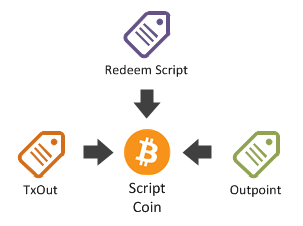

## P2W* over P2SH {#p2w-over-p2sh}

While using **witness scriptPubKey** for your scripting needs is appealing, the reality is that most of nowadays wallets only support P2PKH or P2SH addresses.

To harness the advantages of segwit, while being compatible with old software, P2W over P2SH is allowed. For old node, it will look like a normal P2SH payment.

You can transform any **P2W*** to a **P2W* over** **P2SH** by:

1.  Replacing the **ScriptPubKey** by its P2SH equivalent.
2.  The former **ScriptPubKey** will be placed as the only push in the **scriptSig** in the spending transaction,
3.  All other data will be pushed in the witness of the spending transaction.

Don’t worry, if this sound complicated, the TransactionBuilder will allow you to abstract the plumbing effectively.

Let’s take the example of P2WPKH over P2SH, also called with the sweet name of **P2SH(P2WPKH)**.

Printing the **ScriptPubKey**:  

```cs
var key = new Key();
Console.WriteLine(key.PubKey.WitHash.ScriptPubKey.Hash.ScriptPubKey);
```  

> **Note:** that's quite an awesome line of code.  

Which gives us a well known P2SH **scriptPubKey**.  

```
OP_HASH160 b19da5ca6e7243d4ec8eab07b713ff8768a44145 OP_EQUAL
```  

Then, a signed transaction spending this output will look like:  

```json
"in": [
    {
      "prev_out": {
        "hash": "674ece694e5e28956138efacab96fc0bffd7c6cc1af7bb2729943fedf8f0b8b9",
        "n": 0
      },
      "scriptSig": "001404100ab485c95701bf0f4d73e3fe7d69ecc4f0ea",
      "witness": "3045022100f4c14cf383c0c97bbdaf520ea06f7db6c61e0effbc4bd3dfea036a90272f6cce022055b0fc058759a7961e718d48a3dc4dd5580fffc310557925a0865dbe467a835901 0205b956a5afe8f34a01337f0949f5733b5e376caaea57c9624e40e739a0b1d16c"
    }
  ],
```  

The **scriptSig** is only the push of the P2SH redeem script of the previous ScriptPubKey (in other words **key.PubKey.WitHash.ScriptPubKey**). The witness is exactly the same as a normal **P2WPKH** payment.

In NBitcoin, signing a **P2SH(P2WPKH)** is exactly similar as signing a normal P2SH with ScriptCoin.

By following the same principle, let’s see how a **P2SH(P2WSH)** looks like. You need to understand that in this case we are dealing with two different redeem scripts: The **P2SH redeem script** that need to be put in the **scriptSig** of the spending transaction, AND the **P2WSH redeem script** that need to be put in the witness.

Let’s print the **scriptPubKey** by following the first rule:

1.  Replacing the **ScriptPubKey** by its P2SH equivalent.  

    ```cs
var key = new Key();
Console.WriteLine(key.PubKey.ScriptPubKey.WitHash.ScriptPubKey.Hash.ScriptPubKey);
    ```  
    ```
OP_HASH160 d06c0058175952afecc56d26ed16558b1ed40e42 OP_EQUAL
    ```  
    > **Warning:** It makes sense, don't try whiny ragequitting!  
2.  The former **ScriptPubKey** will be placed as the only push in the **scriptSig** in the spending transaction,
3.  All other data will be pushed in the witness of the spending transaction,

For 3\. the **‘other data’**, in the context of a P2WSH payment means the parameters of the **P2WSH redeem script** followed by a push of the **P2WSH redeem script**.

```json
  "in": [
    {
      "prev_out": {
        "hash": "1d23fa744a26cf6433f0841e9de7e088cf95e6f953e584b98d0de6ef4216765f",
        "n": 0
      },
      "scriptSig": "0020c54eb79829b2e26b71d15fd3b490b6e95cbdab361a45eed2cdfe642497480a6c",
      "witness": "3045022100d7570c3bf87149a0be3ba2e8bfccbdd35c3da44f741695e9962014795fabc4fc02203183cfa55a85728520b0f1ac59ac3ffa1a8526634fe619f99fac0f76016f366e01 2103146e87d7fcc81f3e044f97c6b262c01826f40a9ab9acae0f689983a5890a1f4dac"
    }
  ],

```  

In summary, the P2SH Redeem Script is hashed to get the P2WSH scriptPubKey as normal P2WSH payment. Then, as a normal P2SH payment the P2WSH scriptPubKey is replaced by hashed and used to create the actual P2SH.

If P2SH/P2WSH/P2SH(P2WSH)/P2SH(P2WPKH) sounds complicated to you, fear not.  
NBitcoin, for **all of those payments type**, only requires you to create a **ScriptCoin** by supplying the Redeem (P2WSH redeem or P2SH redeem) and the ScriptPubKey, exactly as explained in the **P2SH** part.

As far as NBitcoin is concerned, you just need to feed the right transaction output you want to spend, with the right underlying redeem script, and the **TransactionBuilder** will figure out how to sign correctly as explained in the previous **Multi Sig** part and the next “**Using the TransactionBuilder**” part.  

  

**Compatible for P2SH/P2WSH/P2SH(P2WSH)/P2SH(P2WPKH)**

You can browse additional examples of P2W* payments on [http://n.bitcoin.ninja/checkscript](http://n.bitcoin.ninja/checkscript)
