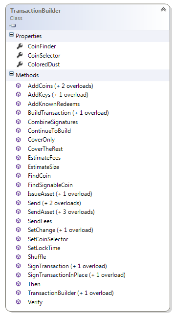

## Using the TransactionBuilder {#using-the-transactionbuilder}

You have seen how the **TransactionBuilder** works when you have signed your first **P2SH** and **multi-sig** transaction.  

We will see how you can harness its full power, for signing more complicated transactions.    

With the **TransactionBuilder** you can:  
*   Spend any  
  *   **P2PK**, **P2PKH**,  
  *   **multi-sig**,  
  *   **P2WPK**, **P2WSH**.  
*   Spend any **P2SH** on the previous redeem script.  
*   Spend **Stealth Coin** (DarkWallet).  
*   Issue and transfer **Colored Coins** (open asset, following chapter).  
*   Combine **partially signed transactions**.  
*   Estimate the final **size** of an **unsigned transaction** and its **fees**.  
*   Verify if a **transaction** is **fully signed**.  

The goal of the **TransactionBuilder** is to take **Coins** and **Keys** as input, and return back a **signed** or **partially signed transaction**.  

  

The **TransactionBuilder** will figure out what **Coin** to use and what to sign by itself.  

  

The usage of the builder is done in four steps:  
*   You gather the **Coins** that spent,
*   You gather the **Keys** that you own,
*   You enumerate how much **Money** you want to send to what **scriptPubKey**,
*   You build and sign the **transaction**,
*   **Optional**: you give the **transaction** to somebody else, then he will sign or continue to build it.

So let’s gather some coins, for that let’s create a fake transaction with some funds on it.Let’s say that the transaction has a P2PKH, P2PK, and multi sig coin of Bob and Alice.

Now let’s say they want to use the coins of this transaction to pay Satoshi, they have to get the **Coins**.

Now let’s say bob wants to sends 0.2 BTC, Alice 0.3 BTC, and they agree to use bobAlice to sends 0.5 BTC.

Then you can verify it is fully signed and ready to send to the network,

True

The nice thing about this model is that it works the same way for **P2SH, P2WSH, P2SH(P2WSH)**, and **P2SH(P2PKH)** except you need to create **ScriptCoin**.

Then the signature

True

For **Stealth Coin**, this is basically the same thing. Except that, if you remember our introduction on Dark Wallet, I said that you need a **ScanKey** to see the **StealthCoin**.

Let’s create darkAliceBob stealth address as in previous chapter:

Let’s say someone sent this transaction:

The scanner will detect the StealthCoin:

And forward it to bob and alice, who will sign :

True

Note: You need the scanKey for spending a StealthCoin